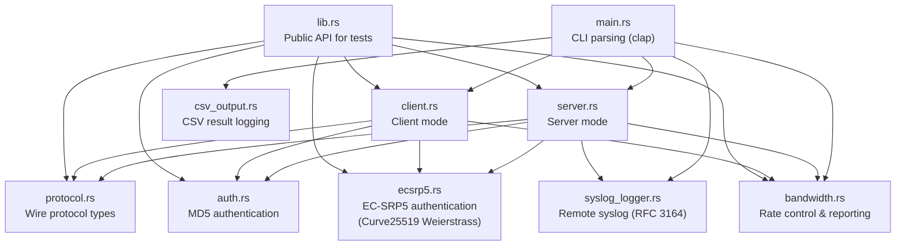
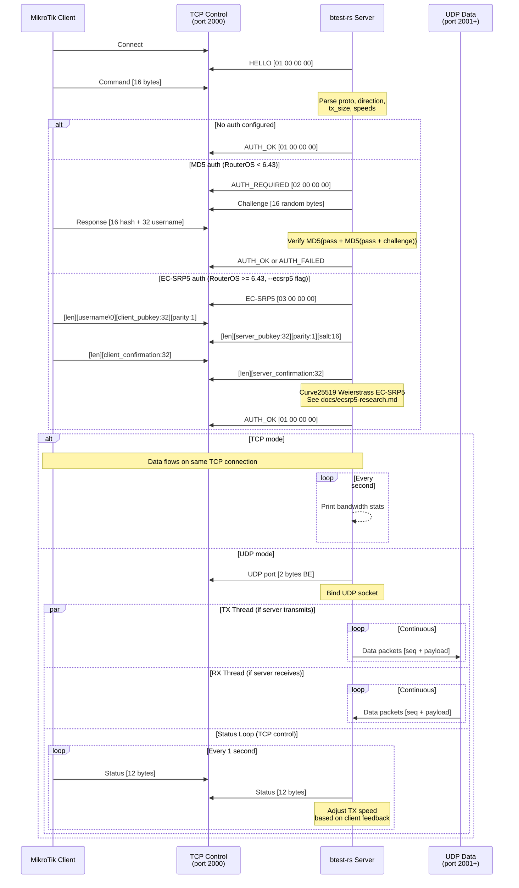
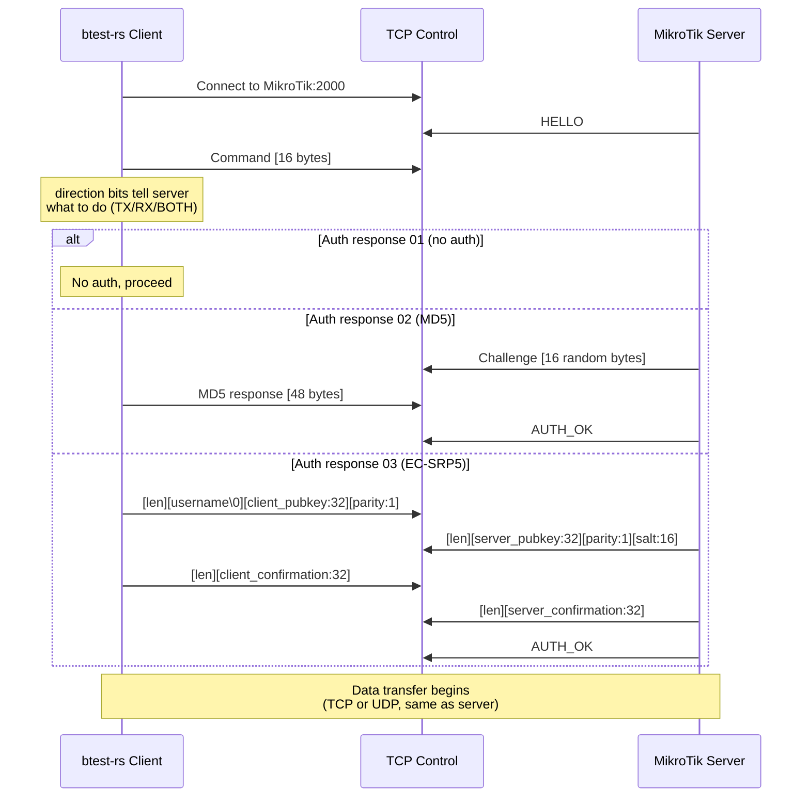
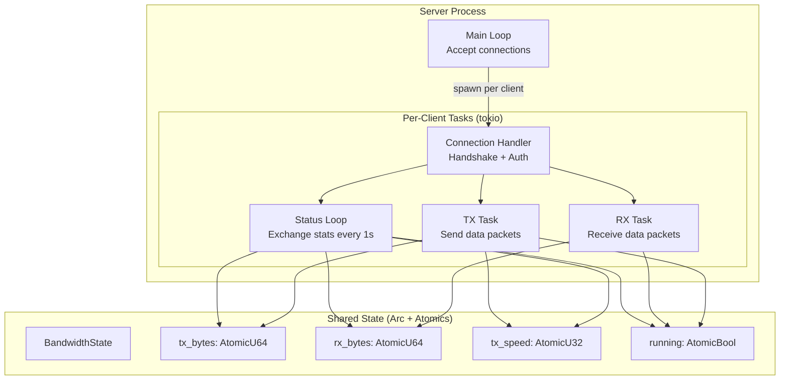

# btest-rs Architecture

## Overview

btest-rs is a Rust reimplementation of the MikroTik Bandwidth Test protocol. It operates in two modes: **server** (accepts connections from MikroTik devices) and **client** (connects to MikroTik btest servers).

## Module Structure



## Data Flow

### Server Mode (MikroTik connects to us)



### Client Mode (we connect to MikroTik)



## Threading Model



## Key Design Decisions

### 1. Tokio async runtime

All I/O is async via tokio. Each client connection spawns independent tasks for TX, RX, and status exchange. This allows handling hundreds of concurrent connections on a single thread pool.

### 2. Lock-free shared state

TX/RX threads and the status loop share bandwidth counters via `AtomicU64`. No mutexes needed -- `swap(0)` atomically reads and resets counters each interval.

### 3. Sequential status loop (matching C pselect)

The UDP status exchange uses a sequential timeout-read-then-send pattern rather than `tokio::select!`. This ensures our status messages are sent exactly every 1 second, preventing MikroTik's speed adaptation from seeing irregular feedback.

### 4. Direction bits from server perspective

The direction byte in the protocol means what the **server** should do:
- `0x01` (CMD_DIR_RX) = server receives
- `0x02` (CMD_DIR_TX) = server transmits
- `0x03` (CMD_DIR_BOTH) = bidirectional

The client inverts before sending: client "transmit" sends `CMD_DIR_RX` (telling server to receive).

### 5. TCP socket half keepalive

When only one direction is active (e.g., TX only), the unused socket half is kept alive. Dropping `OwnedWriteHalf` sends a TCP FIN, which MikroTik interprets as disconnection.

### 6. Static musl binary

Release builds use musl for a fully static binary with zero runtime dependencies. The binary is approximately 2 MB and runs on any Linux distribution.

### 7. EC-SRP5 with big integer arithmetic

The EC-SRP5 implementation uses `num-bigint` for Curve25519 Weierstrass-form elliptic curve arithmetic. MikroTik's authentication uses the Weierstrass form (not the more common Montgomery or Edwards forms), requiring direct field arithmetic over the prime `2^255 - 19`. The implementation includes point multiplication, `lift_x`, `redp1` (hash-to-curve), and Montgomery coordinate conversion.

### 8. Global singletons for syslog and CSV

The syslog and CSV modules use `Mutex<Option<...>>` global statics. This avoids threading state through every function call while remaining safe. Both modules are initialized once at startup and used from any async task via their public API functions.

## File Layout

```
btest-rs/
├── src/
│   ├── main.rs              # CLI entry point, argument parsing (clap)
│   ├── lib.rs               # Public API (used by integration tests)
│   ├── protocol.rs          # Wire format: Command, StatusMessage, constants
│   ├── auth.rs              # MD5 challenge-response authentication
│   ├── ecsrp5.rs            # EC-SRP5 authentication (Curve25519 Weierstrass)
│   ├── server.rs            # Server mode: listener, TCP/UDP handlers
│   ├── client.rs            # Client mode: connector, TCP/UDP handlers
│   ├── bandwidth.rs         # Rate limiting, formatting, shared state
│   ├── csv_output.rs        # CSV result logging (append-mode, auto-header)
│   └── syslog_logger.rs     # Remote syslog sender (RFC 3164 / BSD format)
├── tests/
│   └── integration_test.rs  # End-to-end server/client tests
├── scripts/
│   ├── build-linux.sh           # Cross-compile for x86_64 Linux (musl)
│   ├── build-macos-release.sh   # macOS release build
│   ├── install-service.sh       # systemd service installer
│   ├── push-docker.sh           # Push Docker image to registry
│   ├── test-local.sh            # Loopback self-test
│   ├── test-mikrotik.sh         # Test against MikroTik device
│   ├── test-docker.sh           # Docker container test
│   └── debug-capture.sh         # Packet capture for debugging
├── docs/
│   ├── architecture.md          # This file
│   ├── protocol.md              # Protocol specification
│   ├── user-guide.md            # Usage documentation
│   ├── docker.md                # Docker & deployment guide
│   ├── ecsrp5-research.md       # EC-SRP5 reverse-engineering notes
│   └── man/
│       └── btest.1              # Unix manual page (troff format)
├── Dockerfile                   # Production Docker image (multi-stage)
├── Dockerfile.cross             # Cross-compilation for Linux x86_64
├── docker-compose.yml           # Docker Compose configuration
├── Cargo.toml                   # Rust package manifest
├── Cargo.lock                   # Dependency lock file
├── LICENSE                      # MIT License
└── btest-opensource/            # Original C implementation (git submodule)
```
