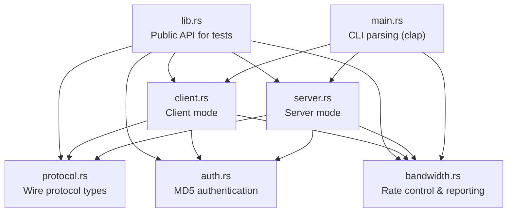
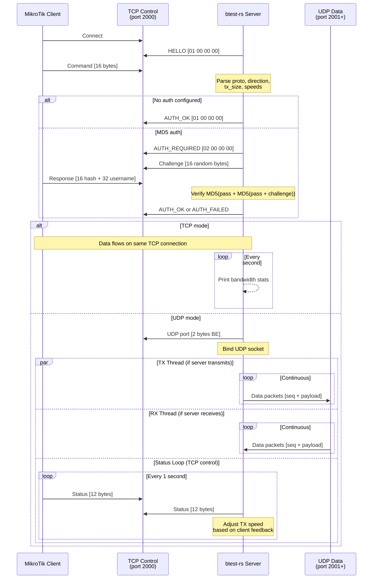
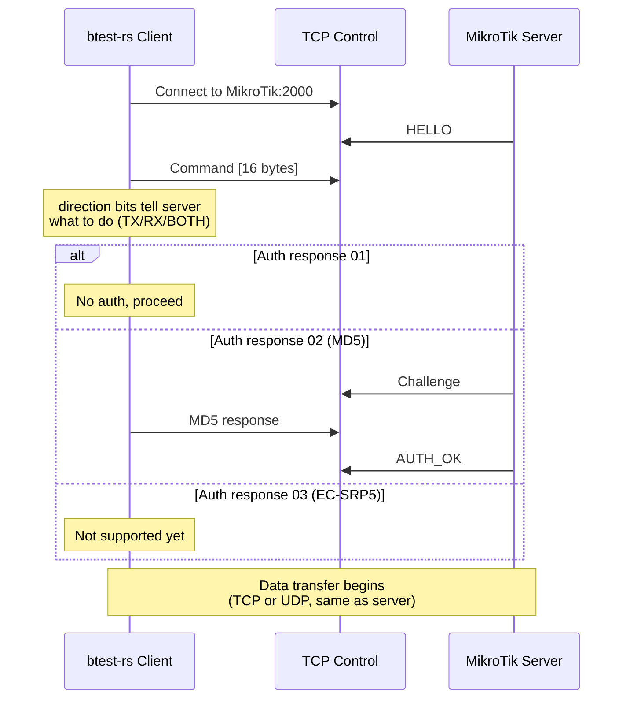
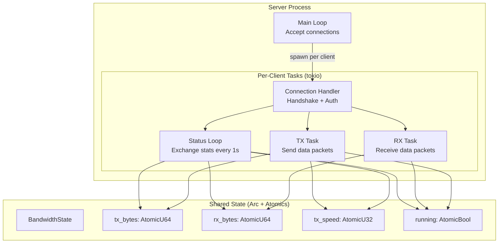

# btest-rs Architecture

## Overview

btest-rs is a Rust reimplementation of the MikroTik Bandwidth Test protocol. It operates in two modes: **server** (accepts connections from MikroTik devices) and **client** (connects to MikroTik btest servers).

## Module Structure



## Data Flow

### Server Mode (MikroTik connects to us)



### Client Mode (we connect to MikroTik)



## Threading Model



## Key Design Decisions

### 1. Tokio async runtime
All I/O is async via tokio. Each client connection spawns independent tasks for TX, RX, and status exchange. This allows handling hundreds of concurrent connections on a single thread pool.

### 2. Lock-free shared state
TX/RX threads and the status loop share bandwidth counters via `AtomicU64`. No mutexes needed — `swap(0)` atomically reads and resets counters each interval.

### 3. Sequential status loop (matching C pselect)
The UDP status exchange uses a sequential timeout-read-then-send pattern rather than `tokio::select!`. This ensures our status messages are sent exactly every 1 second, preventing MikroTik's speed adaptation from seeing irregular feedback.

### 4. Direction bits from server perspective
The direction byte in the protocol means what the **server** should do:
- `0x01` (CMD_DIR_RX) = server receives
- `0x02` (CMD_DIR_TX) = server transmits
- `0x03` (CMD_DIR_BOTH) = bidirectional

The client inverts before sending: client "transmit" → `CMD_DIR_RX` (telling server to receive).

### 5. TCP socket half keepalive
When only one direction is active (e.g., TX only), the unused socket half is kept alive. Dropping `OwnedWriteHalf` sends a TCP FIN, which MikroTik interprets as disconnection.

### 6. Static musl binary
Release builds use musl for a fully static binary with zero runtime dependencies. The binary is 2 MB and runs on any Linux.

## File Layout

```
btest-rs/
├── src/
│   ├── main.rs          # CLI entry point, argument parsing
│   ├── lib.rs           # Public API (used by integration tests)
│   ├── protocol.rs      # Wire format: Command, StatusMessage, constants
│   ├── auth.rs          # MD5 challenge-response authentication
│   ├── server.rs        # Server mode: listener, TCP/UDP handlers
│   ├── client.rs        # Client mode: connector, TCP/UDP handlers
│   └── bandwidth.rs     # Rate limiting, formatting, shared state
├── tests/
│   └── integration_test.rs  # End-to-end server/client tests
├── scripts/
│   ├── build-linux.sh       # Cross-compile for x86_64 Linux
│   ├── install-service.sh   # systemd service installer
│   ├── test-local.sh        # Loopback self-test
│   ├── test-mikrotik.sh     # Test against MikroTik device
│   └── test-docker.sh       # Docker container test
├── docs/
│   ├── architecture.md      # This file
│   ├── protocol.md          # Protocol specification
│   ├── user-guide.md        # Usage documentation
│   └── docker.md            # Docker & deployment guide
├── Dockerfile               # Production Docker image
├── Dockerfile.cross         # Cross-compilation for Linux x86_64
├── docker-compose.yml       # Docker Compose configuration
├── Cargo.toml
└── btest-opensource/        # Original C implementation (git submodule)
```
