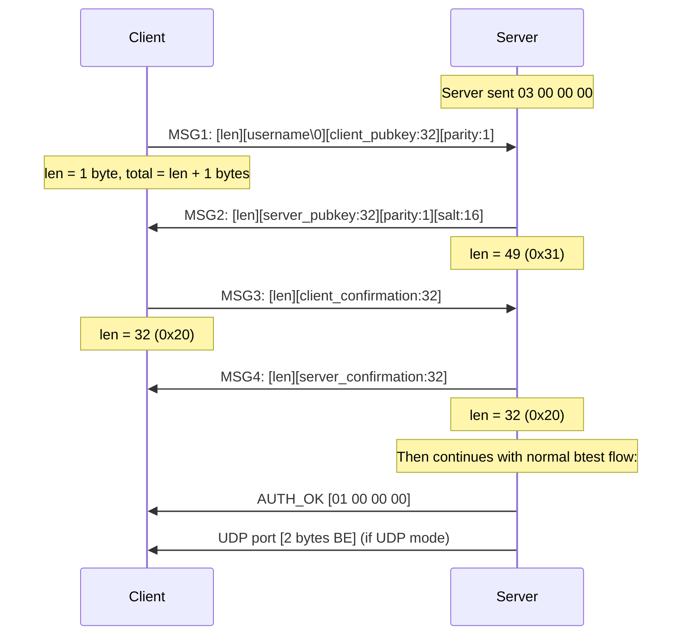

# EC-SRP5 Authentication Research

## Summary

MikroTik RouterOS >= 6.43 uses EC-SRP5 (Elliptic Curve Secure Remote Password) for authentication. When the btest server has auth enabled, it responds with `03 00 00 00` instead of `02 00 00 00` (legacy MD5).

**Status: Fully reverse-engineered and verified.** Python prototype authenticates successfully against MikroTik RouterOS 7.x btest server.

## Discovery Process

### Step 1: Initial Capture

Connected our client to MikroTik btest server with auth enabled. Server responded with `03 00 00 00` and waited for the client to initiate.

### Step 2: Winbox EC-SRP5 Verification

Tested the EC-SRP5 crypto implementation (from [MarginResearch/mikrotik_authentication](https://github.com/MarginResearch/mikrotik_authentication)) against MikroTik's Winbox port (8291). **Authentication succeeded**, confirming the elliptic curve math is correct.

### Step 3: Framing Discovery via MITM

The Winbox `[len][0x06][payload]` framing was rejected by the btest port. To discover the correct framing, we built a MITM proxy (`proto-test/btest_mitm.py`) and routed a MikroTik client through it to the MikroTik server.

**Finding: btest uses `[len][payload]` — identical to Winbox but without the `0x06` handler byte.**

### Step 4: Successful Authentication

Updated the Python prototype to use `[len][payload]` framing. EC-SRP5 authentication against MikroTik's btest server succeeded and data transfer began.

## Protocol Specification

### Auth Trigger

After the standard btest handshake (HELLO + Command), the server responds:

```
01 00 00 00  →  No auth required
02 00 00 00  →  MD5 challenge-response (RouterOS < 6.43)
03 00 00 00  →  EC-SRP5 (RouterOS >= 6.43)
```

### EC-SRP5 Handshake (4 messages after `03 00 00 00`)



### Framing Comparison

| Protocol | Message framing |
|----------|----------------|
| Winbox (port 8291) | `[len:1][0x06][payload]` |
| **btest (port 2000)** | **`[len:1][payload]`** |
| MAC Telnet (UDP 20561) | Control packets with magic bytes |

The `0x06` handler byte in Winbox identifies the message as an auth message. Btest omits it since the auth context is implicit after `03 00 00 00`.

### Captured Exchange (from MITM)

```
CLIENT → SERVER (40 bytes):
  27 61 6e 74 61 72 00 38 8a 37 36 52 6a 32 e9 87   'antar.8.76Rj2..
  4e 92 f8 c3 aa a1 18 da cd 71 b6 ab 76 fd 72 aa   N........q..v.r.
  c3 f6 6a 43 9b c8 a1 01                             ..jC....

  Decoded:
    len=0x27 (39 bytes payload)
    username="antar\0"
    pubkey=388a373652...c8a1 (32 bytes)
    parity=0x01

SERVER → CLIENT (50 bytes):
  31 6c c9 e3 1a 79 43 4a 40 51 de fd 55 cc 8d 6d   1l...yCJ@Q..U..m
  3c ec cd 73 19 1f a6 83 15 94 62 52 97 fe 5d 89   <..s......bR..].
  1a 00 3c ec 65 b8 34 28 0a 16 c5 48 0d 7b 50 00   ..<.e.4(...H.{P.
  e3 80                                               ..

  Decoded:
    len=0x31 (49 bytes payload)
    server_pubkey=6cc9e31a...5d891a (32 bytes)
    parity=0x00
    salt=3cec65b834280a16c5480d7b5000e380 (16 bytes)

CLIENT → SERVER (33 bytes):
  20 9b 1f 74 ec 40 31 2c ...

  Decoded:
    len=0x20 (32 bytes payload)
    client_cc=9b1f74ec... (32 bytes, SHA256 proof)

SERVER → CLIENT (33 bytes):
  20 7d 59 b3 2e 28 6e 52 ...

  Decoded:
    len=0x20 (32 bytes payload)
    server_cc=7d59b32e... (32 bytes, SHA256 proof)

POST-AUTH:
  01 00 00 00 07 fa

  Decoded:
    AUTH_OK=01000000
    UDP_port=0x07fa (2042)
```

## Cryptographic Details

### Elliptic Curve: Curve25519 in Weierstrass Form

```
p  = 2^255 - 19
r  = curve order (same as Ed25519)
Montgomery A = 486662

Weierstrass conversion:
  a = 0x2aaaaaaaaaaaaaaaaaaaaaaaaaaaaaaaaaaaaaaaaaaaaaaaaaaaaa984914a144
  b = 0x7b425ed097b425ed097b425ed097b425ed097b425ed097b4260b5e9c7710c864

Generator: lift_x(9) in Montgomery, converted to Weierstrass
Cofactor: 8
```

All EC math is in Weierstrass form. Public keys are transmitted as Montgomery x-coordinates (32 bytes big-endian) plus a 1-byte y-parity flag.

### Key Derivation

```
inner = SHA256(username + ":" + password)
validator_priv (i) = SHA256(salt || inner)
validator_pub (x_gamma) = i * G
```

### Shared Secret Computation

**Client side (ECPESVDP-SRP-A):**
```
v = redp1(x_gamma, parity=1)         # hash-to-curve of validator pubkey
w_b = lift_x(server_pubkey) + v      # undo verifier blinding
j = SHA256(client_pubkey || server_pubkey)
scalar = (i * j + s_a) mod r         # combined scalar
Z = scalar * w_b                     # shared secret point
z = to_montgomery(Z).x              # Montgomery x-coordinate
```

**Server side (ECPESVDP-SRP-B):**
```
gamma = redp1(x_gamma, parity=0)
w_a = lift_x(client_pubkey)
Z = s_b * (w_a + j * gamma)         # where j = SHA256(x_w_a || x_w_b)
z = to_montgomery(Z).x
```

### Confirmation Codes

```
client_cc = SHA256(j || z)
server_cc = SHA256(j || client_cc || z)
```

Both sides verify the peer's confirmation code to ensure the shared secret matches.

### redp1 (Hash-to-Curve)

```python
def redp1(x_bytes, parity):
    x = SHA256(x_bytes)
    while True:
        x2 = SHA256(x)
        point = lift_x(int(x2), parity)
        if point is valid:
            return point
        x = (int(x) + 1).to_bytes(32)
```

## Implementation Plan for Rust

### Required Crates

| Crate | Purpose |
|-------|---------|
| `num-bigint` + `num-traits` | Big integer arithmetic for field operations |
| `sha2` | SHA-256 |
| `ecdsa` or custom | Curve25519 Weierstrass point operations |

**Note:** `curve25519-dalek` operates in Montgomery/Edwards form, not Weierstrass. We need Weierstrass arithmetic for compatibility with MikroTik's implementation. Options:
1. Use `num-bigint` for direct field arithmetic (like the Python `ecdsa` library)
2. Use the `p256` crate's infrastructure with custom curve parameters
3. Port the Python `WCurve` class directly using big integers

### Implementation Steps

1. **Port `WCurve`** — Weierstrass curve with Curve25519 parameters, point multiplication, `lift_x`, `redp1`, Montgomery conversion
2. **Port EC-SRP5 client** — generate keypair, compute shared secret, confirmation codes
3. **Port EC-SRP5 server** — verify client proof, generate server proof (for our server mode)
4. **Integrate into `auth.rs`** — handle `03 00 00 00` response with btest-specific `[len][payload]` framing
5. **Server registration** — derive salt + validator from username/password for server-side verification

### Server-Side Specifics

When our server receives a client with EC-SRP5 support, we need to:
1. Store `salt` and `x_gamma` (validator public key) per user — derived from username + password at startup
2. Generate ephemeral server keypair
3. Compute password-entangled public key: `W_b = s_b * G + redp1(x_gamma, 0)`
4. Verify client's confirmation code
5. Send server confirmation code

## Files

| File | Purpose |
|------|---------|
| `proto-test/elliptic_curves.py` | Curve25519 Weierstrass implementation |
| `proto-test/btest_ecsrp5_client.py` | Working Python btest EC-SRP5 client |
| `proto-test/btest_mitm.py` | MITM proxy for protocol analysis |

## Credits

- **[MarginResearch](https://github.com/MarginResearch/mikrotik_authentication)** — Reverse-engineered MikroTik's EC-SRP5 for Winbox/MAC Telnet
- **[Margin Research blog](https://margin.re/2022/02/mikrotik-authentication-revealed/)** — Detailed write-up of MikroTik authentication
- **btest framing discovery** — MITM analysis showing btest uses `[len][payload]` (no `0x06` handler byte)
