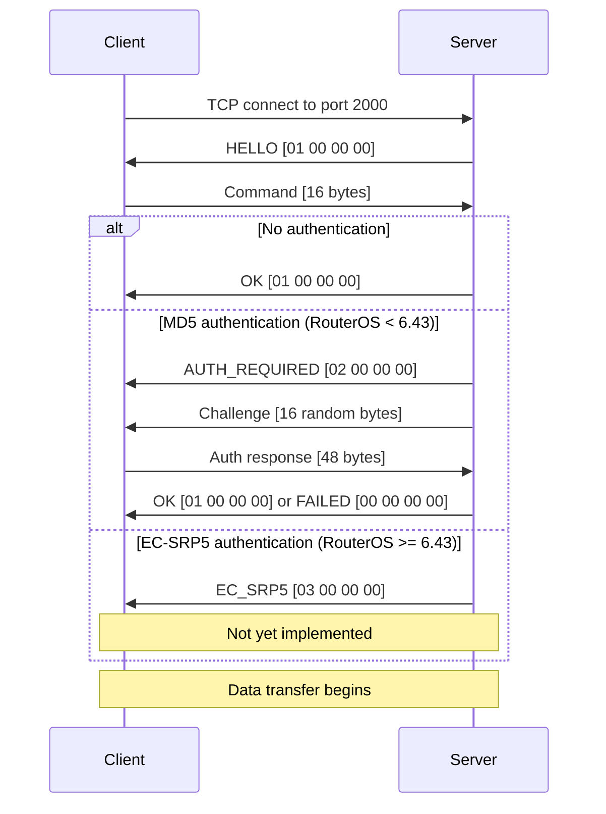
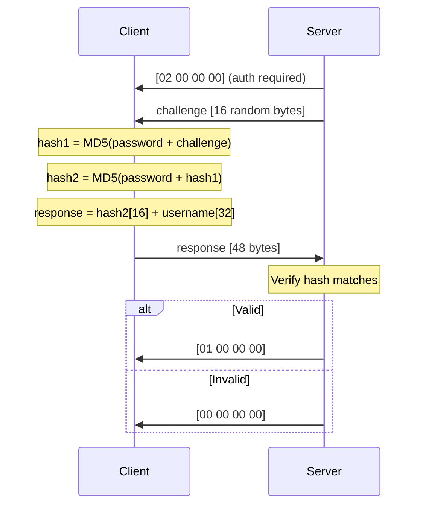
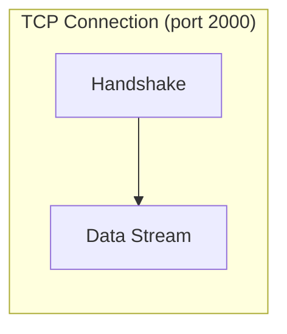
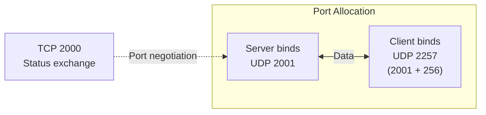
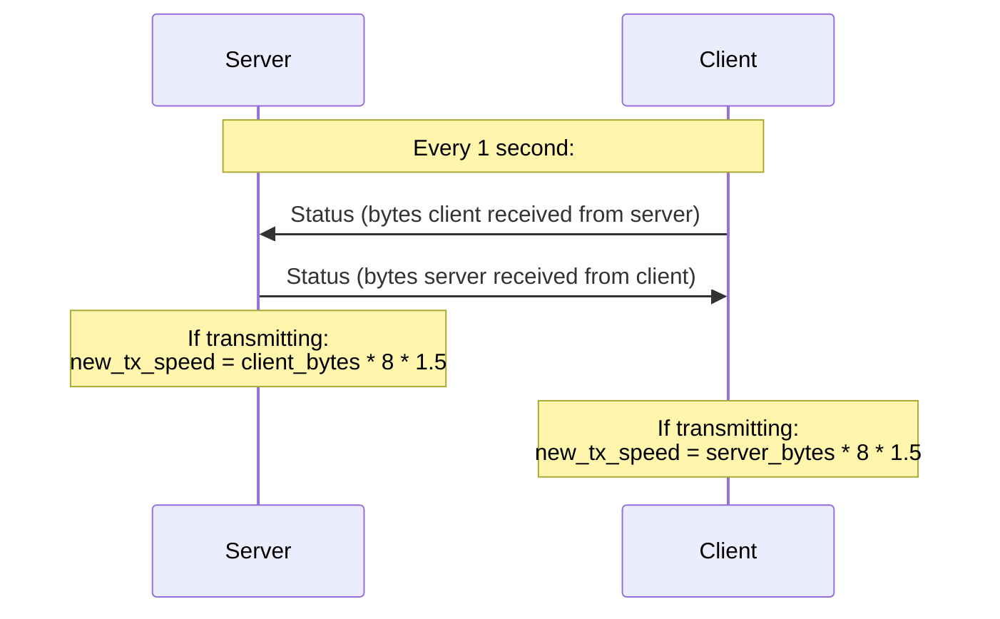
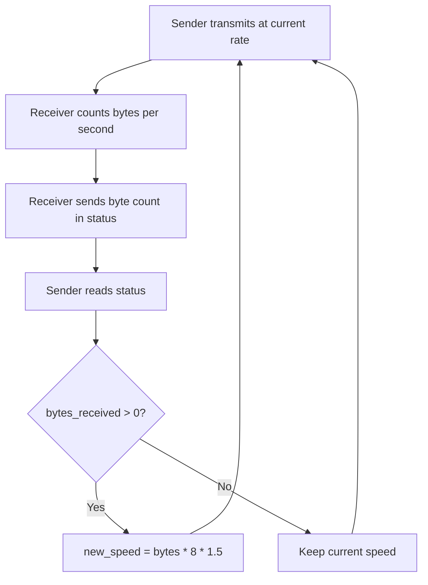

# MikroTik Bandwidth Test Protocol Specification

This document describes the MikroTik btest wire protocol as reverse-engineered from RouterOS traffic captures. Based on the work of [Alex Samorukov](https://github.com/samm-git/btest-opensource).

## Connection Setup

All communication begins on **TCP port 2000**.



## Command Structure (16 bytes)

Sent by client after receiving HELLO.

```
Offset  Size  Type       Field              Description
──────  ────  ────       ─────              ───────────
0       1     uint8      protocol           0x00=UDP, 0x01=TCP
1       1     uint8      direction          Bit flags (server perspective)
2       1     uint8      random_data        0x00=random, 0x01=zeros
3       1     uint8      tcp_conn_count     Number of parallel TCP connections
4-5     2     uint16 LE  tx_size            Bytes per packet
6-7     2     uint16 LE  client_buf_size    Client buffer size (0=default)
8-11    4     uint32 LE  remote_tx_speed    Remote TX speed (bits/sec, 0=unlimited)
12-15   4     uint32 LE  local_tx_speed     Local TX speed (bits/sec, 0=unlimited)
```

### Direction Flags

Direction bits describe what the **server** should do:

| Value | Name     | Server action     | Client action     |
|-------|----------|-------------------|-------------------|
| 0x01  | DIR_RX   | Server receives   | Client transmits  |
| 0x02  | DIR_TX   | Server transmits  | Client receives   |
| 0x03  | DIR_BOTH | Both directions   | Both directions   |

**Important**: The client inverts when constructing the command:
- Client selects "transmit" → sends `0x01` (server should receive)
- Client selects "receive" → sends `0x02` (server should transmit)

### Default TX Sizes

| Protocol | Default tx_size |
|----------|----------------|
| TCP      | 32768 (0x8000) |
| UDP      | 1500 (0x05DC)  |

### Example Commands

```
TCP transmit:            01 01 01 00 00 80 00 00 00 00 00 00 00 00 00 00
TCP receive:             01 02 01 00 00 80 00 00 00 00 00 00 00 00 00 00
TCP both:                01 03 01 00 00 80 00 00 00 00 00 00 00 00 00 00
UDP transmit:            00 01 01 00 DC 05 00 00 00 00 00 00 00 00 00 00
UDP receive:             00 02 01 00 DC 05 00 00 00 00 00 00 00 00 00 00
UDP both:                00 03 01 00 DC 05 00 00 00 00 00 00 00 00 00 00
```

## MD5 Authentication

### Challenge-Response Flow



### Hash Computation (Double MD5)

```
hash1 = MD5(password_bytes + challenge_16_bytes)
hash2 = MD5(password_bytes + hash1_16_bytes)
```

The 48-byte response is:
- Bytes 0-15: `hash2`
- Bytes 16-47: username, null-padded to 32 bytes

### Known Test Vector

```
Password:  "test"
Challenge: ad32d6f94d28161625f2f390bb895637 (hex)
Expected:  3c968565bc0314f281a6da1571cf7255 (hex)
```

## TCP Data Transfer

After handshake, data flows on the **same TCP connection** used for control.



- Packets are `tx_size` bytes (default 32768)
- First byte is `0x07` (status message type marker)
- No separate status exchange for TCP mode
- Speed is limited by TCP flow control

## UDP Data Transfer

### Port Assignment



1. Server selects port: `2001 + offset` (increments per connection)
2. Server sends port to client over TCP (2 bytes, big-endian)
3. Client binds to `server_port + 256`
4. Both sides `connect()` their UDP sockets to the peer

### UDP Packet Format

```
Offset  Size  Type       Field
──────  ────  ────       ─────
0-3     4     uint32 BE  sequence_number
4+      var   bytes      payload (zeros or random)
```

Total packet size = `tx_size` from command (default 1500 bytes for UDP).

## Status Message (12 bytes)

Exchanged every 1 second over the **TCP control channel** during UDP tests.

```
Offset  Size  Type       Field              Byte Order
──────  ────  ────       ─────              ──────────
0       1     uint8      msg_type           Always 0x07
1-4     4     uint32 BE  seq_number         Big-endian
5-7     3     bytes      padding            Always 00 00 00
8-11    4     uint32 LE  bytes_received     Little-endian
```

### Status Exchange Pattern



**Key rules:**
- Status is **always sent** regardless of direction (unconditional)
- Speed adjustment only applies when the sender is active
- The 1.5x multiplier provides overshoot to converge quickly

### Example Status Messages

```
Server sends: 07 00 00 00 01 00 00 00 C0 2D B4 02
              ── ─────────── ──────── ───────────
              type  seq=1    padding  bytes=45,362,624

Client sends: 07 D9 00 00 01 00 00 00 00 00 00 00
              ── ─────────── ──────── ───────────
              type  seq      padding  bytes=0
```

## Speed Adjustment Algorithm

The dynamic speed adjustment uses a simple feedback loop:



### Interval Calculation

For a target speed in bits/sec and packet size in bytes:

```
interval_ns = (1,000,000,000 × packet_size × 8) / target_speed_bps
```

**Special case**: If interval > 500ms, clamp to exactly 1 second. This replicates a MikroTik behavior where very slow speeds get normalized to 1 packet/second.

## NAT Mode

When `-n` / `--nat` flag is set, the client sends an empty UDP packet before starting the receive thread. This opens a hole in NAT firewalls to allow the server's UDP packets through.

## Protocol Constants

```
BTEST_PORT              = 2000    TCP control port
BTEST_UDP_PORT_START    = 2001    First UDP data port
BTEST_PORT_CLIENT_OFFSET = 256   Client UDP port offset

HELLO                   = [01 00 00 00]
AUTH_OK                 = [01 00 00 00]
AUTH_REQUIRED           = [02 00 00 00]
AUTH_EC_SRP5            = [03 00 00 00]
AUTH_FAILED             = [00 00 00 00]

STATUS_MSG_TYPE         = 0x07
STATUS_MSG_SIZE         = 12 bytes
```
