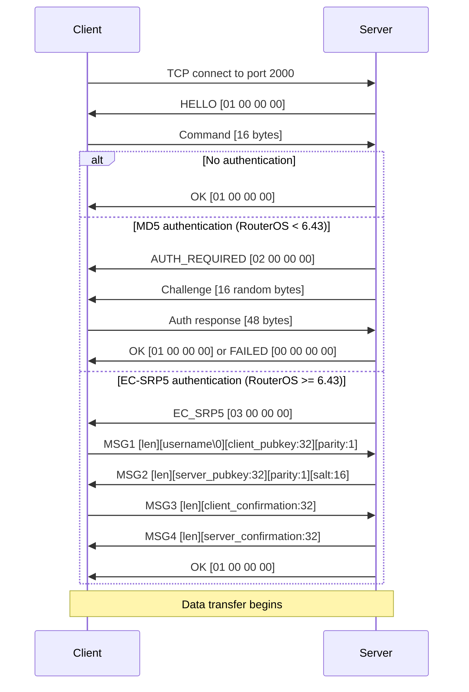
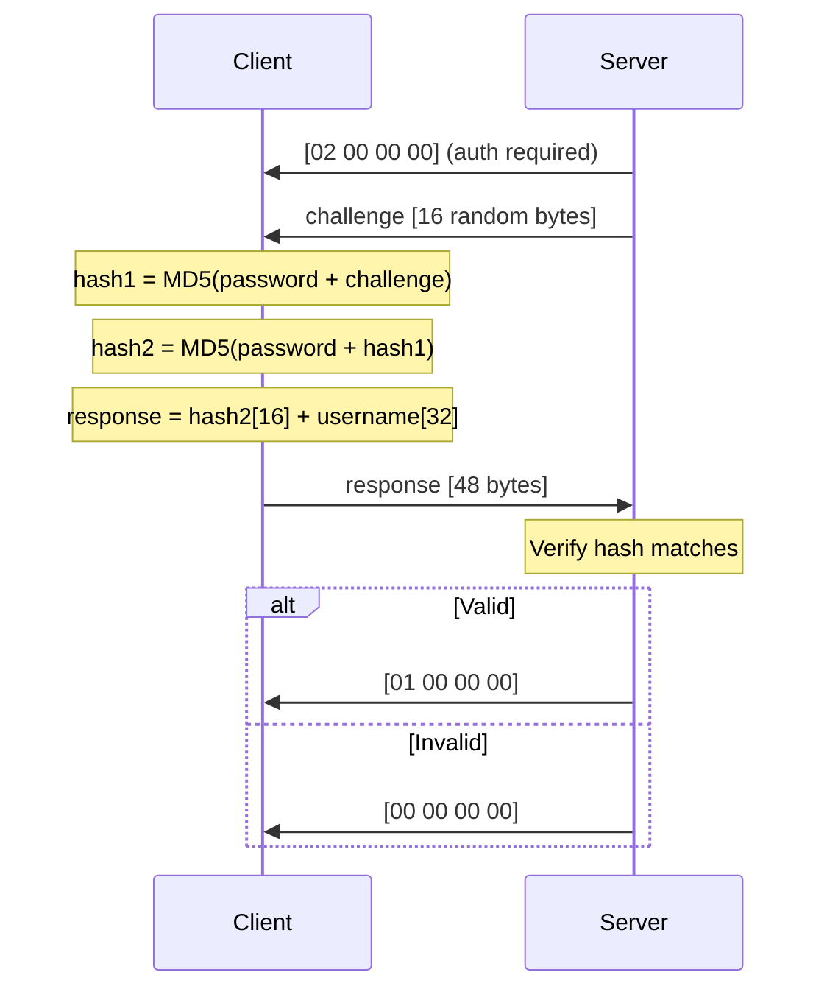
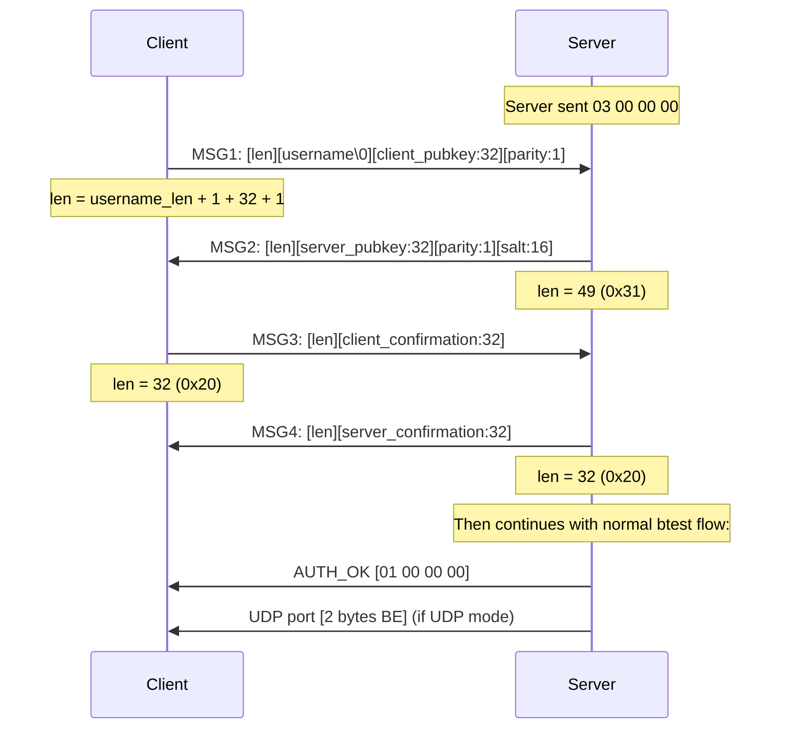
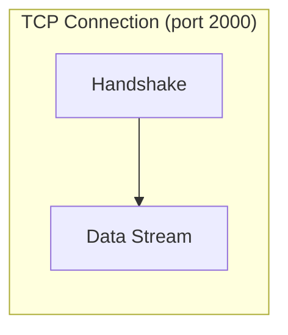
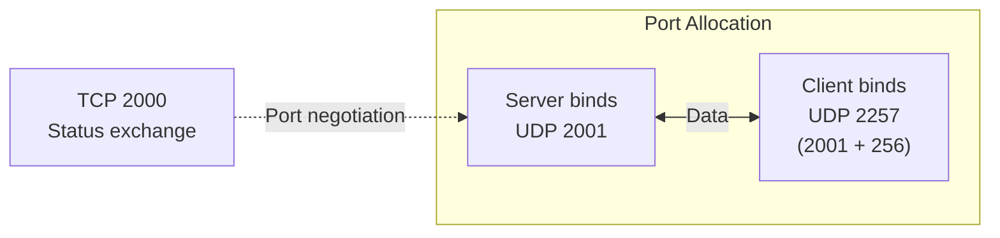
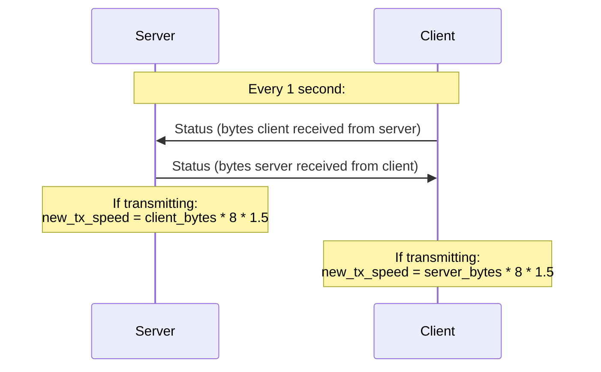
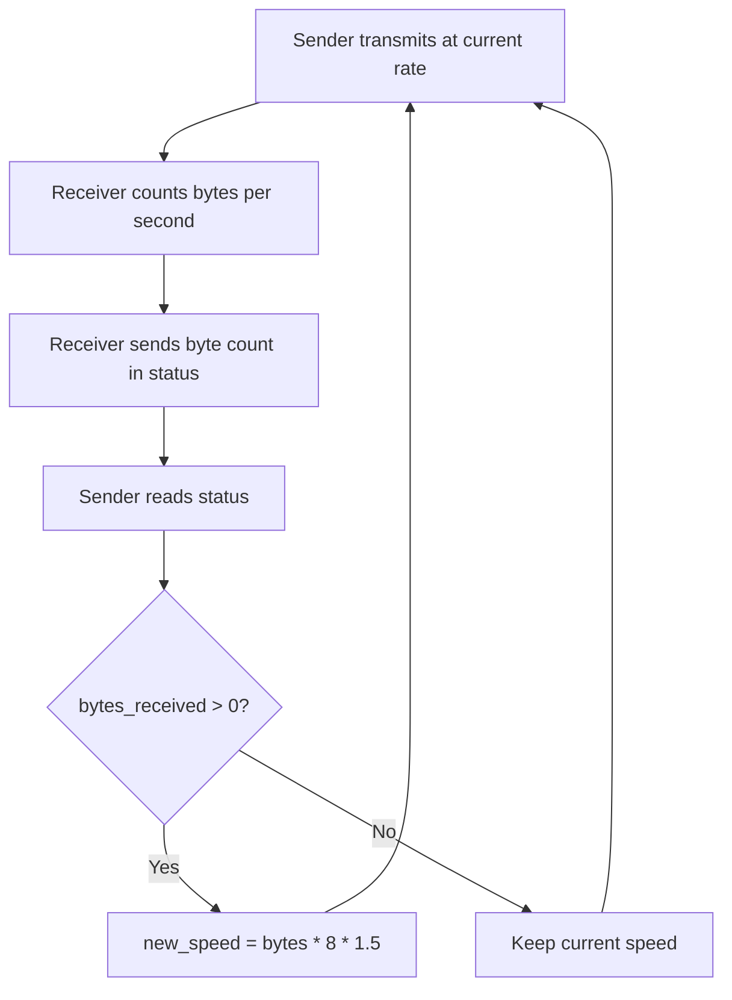

# MikroTik Bandwidth Test Protocol Specification

This document describes the MikroTik btest wire protocol as reverse-engineered from RouterOS traffic captures. Based on the work of [Alex Samorukov](https://github.com/samm-git/btest-opensource) and [Margin Research](https://github.com/MarginResearch/mikrotik_authentication).

## Connection Setup

All communication begins on **TCP port 2000**.



## Command Structure (16 bytes)

Sent by the client after receiving HELLO.

```
Offset  Size  Type       Field              Description
------  ----  ----       -----              -----------
0       1     uint8      protocol           0x00=UDP, 0x01=TCP
1       1     uint8      direction          Bit flags (server perspective)
2       1     uint8      random_data        0x00=random, 0x01=zeros
3       1     uint8      tcp_conn_count     Number of parallel TCP connections
4-5     2     uint16 LE  tx_size            Bytes per packet
6-7     2     uint16 LE  client_buf_size    Client buffer size (0=default)
8-11    4     uint32 LE  remote_tx_speed    Remote TX speed (bits/sec, 0=unlimited)
12-15   4     uint32 LE  local_tx_speed     Local TX speed (bits/sec, 0=unlimited)
```

### Direction Flags

Direction bits describe what the **server** should do:

| Value | Name     | Server action     | Client action     |
|-------|----------|-------------------|-------------------|
| 0x01  | DIR_RX   | Server receives   | Client transmits  |
| 0x02  | DIR_TX   | Server transmits  | Client receives   |
| 0x03  | DIR_BOTH | Both directions   | Both directions   |

**Important**: The client inverts when constructing the command:
- Client selects "transmit" -> sends `0x01` (server should receive)
- Client selects "receive" -> sends `0x02` (server should transmit)

### Default TX Sizes

| Protocol | Default tx_size |
|----------|----------------|
| TCP      | 32768 (0x8000) |
| UDP      | 1500 (0x05DC)  |

### Example Commands

```
TCP transmit:            01 01 01 00 00 80 00 00 00 00 00 00 00 00 00 00
TCP receive:             01 02 01 00 00 80 00 00 00 00 00 00 00 00 00 00
TCP both:                01 03 01 00 00 80 00 00 00 00 00 00 00 00 00 00
UDP transmit:            00 01 01 00 DC 05 00 00 00 00 00 00 00 00 00 00
UDP receive:             00 02 01 00 DC 05 00 00 00 00 00 00 00 00 00 00
UDP both:                00 03 01 00 DC 05 00 00 00 00 00 00 00 00 00 00
```

## MD5 Authentication

### Challenge-Response Flow



### Hash Computation (Double MD5)

```
hash1 = MD5(password_bytes + challenge_16_bytes)
hash2 = MD5(password_bytes + hash1_16_bytes)
```

The 48-byte response is:
- Bytes 0-15: `hash2`
- Bytes 16-47: username, null-padded to 32 bytes

### Known Test Vector

```
Password:  "test"
Challenge: ad32d6f94d28161625f2f390bb895637 (hex)
Expected:  3c968565bc0314f281a6da1571cf7255 (hex)
```

## EC-SRP5 Authentication

EC-SRP5 (Elliptic Curve Secure Remote Password) is used by RouterOS >= 6.43. It provides zero-knowledge password proof using Curve25519 in Weierstrass form.

### Auth Trigger

After the standard btest handshake (HELLO + Command), the server responds with one of:

```
01 00 00 00  ->  No auth required
02 00 00 00  ->  MD5 challenge-response (RouterOS < 6.43)
03 00 00 00  ->  EC-SRP5 (RouterOS >= 6.43)
```

### Message Framing

Unlike Winbox (port 8291) which uses `[len:1][0x06][payload]`, the btest protocol uses a simpler framing:

```
[len:1][payload]
```

The `0x06` handler byte is omitted because the authentication context is implicit after receiving `03 00 00 00`.

| Protocol | Message framing |
|----------|----------------|
| Winbox (port 8291) | `[len:1][0x06][payload]` |
| **btest (port 2000)** | **`[len:1][payload]`** |

### EC-SRP5 Handshake (4 messages)



### Elliptic Curve: Curve25519 in Weierstrass Form

MikroTik's EC-SRP5 uses Curve25519 parameters but operates entirely in Weierstrass form, not the more common Montgomery or Edwards representations.

```
Prime field:  p = 2^255 - 19
Curve order:  r = 2^252 + 27742317777372353535851937790883648493
Montgomery A: 486662

Weierstrass parameters (converted from Montgomery):
  a = 0x2aaaaaaaaaaaaaaaaaaaaaaaaaaaaaaaaaaaaaaaaaaaaaaaaaaaaa984914a144
  b = 0x7b425ed097b425ed097b425ed097b425ed097b425ed097b4260b5e9c7710c864

Generator: lift_x(9) in Montgomery, converted to Weierstrass
Cofactor: 8
```

Public keys are transmitted as Montgomery x-coordinates (32 bytes big-endian) plus a 1-byte y-parity flag.

### Key Derivation

```
inner         = SHA256(username + ":" + password)
salt          = 16 random bytes (generated by server)
validator_priv (i) = SHA256(salt || inner)
validator_pub  (x_gamma) = i * G
```

The server stores `salt` and `x_gamma` (the validator public key) for each user. In btest-rs, these are derived from the username and password at startup.

### Shared Secret Computation

**Client side (ECPESVDP-SRP-A):**
```
v      = redp1(x_gamma, parity=1)          # hash-to-curve of validator pubkey
w_b    = lift_x(server_pubkey) + v          # undo verifier blinding
j      = SHA256(client_pubkey || server_pubkey)
scalar = (i * j + client_secret) mod r      # combined scalar
Z      = scalar * w_b                       # shared secret point
z      = to_montgomery(Z).x                # Montgomery x-coordinate
```

**Server side (ECPESVDP-SRP-B):**
```
gamma  = redp1(x_gamma, parity=0)
w_a    = lift_x(client_pubkey)
j      = SHA256(client_pubkey || server_pubkey)
Z      = server_secret * (w_a + j * gamma)  # shared secret point
z      = to_montgomery(Z).x
```

### Confirmation Codes

```
client_cc = SHA256(j || z)
server_cc = SHA256(j || client_cc || z)
```

Both sides verify the peer's confirmation code to ensure the shared secret matches. If either code is wrong, authentication fails.

### redp1 (Hash-to-Curve)

```
def redp1(x_bytes, parity):
    x = SHA256(x_bytes)
    while True:
        x2 = SHA256(x)
        point = lift_x(int(x2), parity)
        if point is valid:
            return point
        x = (int(x) + 1).to_bytes(32)
```

This deterministically maps a byte string to a valid curve point by repeatedly hashing until a valid x-coordinate is found.

### Captured Exchange (from MITM analysis)

```
CLIENT -> SERVER (40 bytes):
  27 61 6e 74 61 72 00 38 8a 37 36 52 6a 32 e9 87
  4e 92 f8 c3 aa a1 18 da cd 71 b6 ab 76 fd 72 aa
  c3 f6 6a 43 9b c8 a1 01

  Decoded:
    len=0x27 (39 bytes payload)
    username="antar\0"
    pubkey=388a373652...c8a1 (32 bytes)
    parity=0x01

SERVER -> CLIENT (50 bytes):
  31 6c c9 e3 1a 79 43 4a 40 51 de fd 55 cc 8d 6d
  3c ec cd 73 19 1f a6 83 15 94 62 52 97 fe 5d 89
  1a 00 3c ec 65 b8 34 28 0a 16 c5 48 0d 7b 50 00
  e3 80

  Decoded:
    len=0x31 (49 bytes payload)
    server_pubkey=6cc9e31a...5d891a (32 bytes)
    parity=0x00
    salt=3cec65b834280a16c5480d7b5000e380 (16 bytes)

CLIENT -> SERVER (33 bytes):
  20 9b 1f 74 ec 40 31 2c ...

  Decoded:
    len=0x20 (32 bytes payload)
    client_cc=9b1f74ec... (32 bytes, SHA256 proof)

SERVER -> CLIENT (33 bytes):
  20 7d 59 b3 2e 28 6e 52 ...

  Decoded:
    len=0x20 (32 bytes payload)
    server_cc=7d59b32e... (32 bytes, SHA256 proof)

POST-AUTH:
  01 00 00 00 07 fa

  Decoded:
    AUTH_OK=01000000
    UDP_port=0x07fa (2042)
```

## TCP Data Transfer

After handshake, data flows on the **same TCP connection** used for control.



- Packets are `tx_size` bytes (default 32768)
- First byte is `0x07` (status message type marker)
- No separate status exchange for TCP mode
- Speed is limited by TCP flow control

## UDP Data Transfer

### Port Assignment



1. Server selects port: `2001 + offset` (increments per connection)
2. Server sends port to client over TCP (2 bytes, big-endian)
3. Client binds to `server_port + 256`
4. Both sides `connect()` their UDP sockets to the peer

### UDP Packet Format

```
Offset  Size  Type       Field
------  ----  ----       -----
0-3     4     uint32 BE  sequence_number
4+      var   bytes      payload (zeros or random)
```

Total packet size = `tx_size` from command (default 1500 bytes for UDP).

## Status Message (12 bytes)

Exchanged every 1 second over the **TCP control channel** during UDP tests.

```
Offset  Size  Type       Field              Byte Order
------  ----  ----       -----              ----------
0       1     uint8      msg_type           Always 0x07
1-4     4     uint32 BE  seq_number         Big-endian
5-7     3     bytes      padding            Always 00 00 00
8-11    4     uint32 LE  bytes_received     Little-endian
```

### Status Exchange Pattern



**Key rules:**
- Status is **always sent** regardless of direction (unconditional)
- Speed adjustment only applies when the sender is active
- The 1.5x multiplier provides overshoot to converge quickly

### Example Status Messages

```
Server sends: 07 00 00 00 01 00 00 00 C0 2D B4 02
              -- ---------- -------- -----------
              type  seq=1    padding  bytes=45,362,624

Client sends: 07 D9 00 00 01 00 00 00 00 00 00 00
              -- ---------- -------- -----------
              type  seq      padding  bytes=0
```

## Speed Adjustment Algorithm

The dynamic speed adjustment uses a simple feedback loop:



### Interval Calculation

For a target speed in bits/sec and packet size in bytes:

```
interval_ns = (1,000,000,000 * packet_size * 8) / target_speed_bps
```

**Special case**: If interval > 500ms, clamp to exactly 1 second. This replicates a MikroTik behavior where very slow speeds get normalized to 1 packet/second.

## NAT Mode

When `-n` / `--nat` flag is set, the client sends an empty UDP packet before starting the receive thread. This opens a hole in NAT firewalls to allow the server's UDP packets through.

## Protocol Constants

```
BTEST_PORT                = 2000    TCP control port
BTEST_UDP_PORT_START      = 2001    First UDP data port
BTEST_PORT_CLIENT_OFFSET  = 256     Client UDP port offset

HELLO                     = [01 00 00 00]
AUTH_OK                   = [01 00 00 00]
AUTH_REQUIRED             = [02 00 00 00]
AUTH_EC_SRP5              = [03 00 00 00]
AUTH_FAILED               = [00 00 00 00]

STATUS_MSG_TYPE           = 0x07
STATUS_MSG_SIZE           = 12 bytes

DEFAULT_TCP_TX_SIZE       = 32768 (0x8000)
DEFAULT_UDP_TX_SIZE       = 1500  (0x05DC)
```
